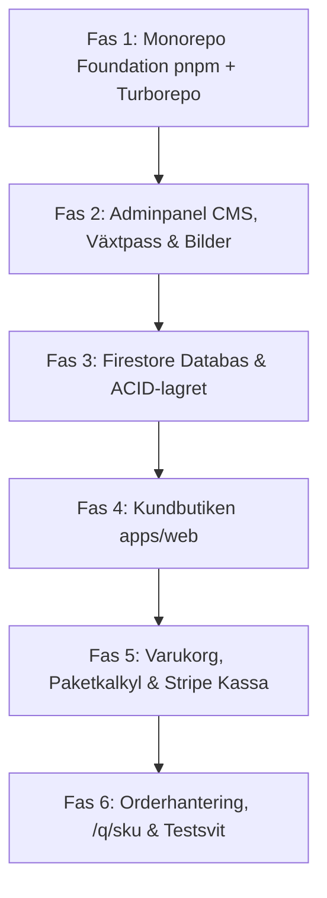

# Masterplan: Produktionsbygge av Öhlunds Brygga

> **Mål:** Bygga ett produktionsklart, skalbart och modulärt e-handelssystem med en integrerad **Adminpanel (CMS, Bildarkiv & Lagerstyrning)**, helt separerat från prototypen (`prototype-sandbox`).

---

## 1. Huvudarkitektur & Teknikstack (pnpm + Turborepo)

* **Bygg- & Paketsystem:**
  - **pnpm workspaces (v12+):** Strikt isolering mot "phantom dependencies". Inga moduler läcker oavsiktligt mellan appar och paket.
  - **Turborepo (v2+):** Blixtsnabb caching av `typecheck`, `lint` och `build` i utveckling och CI/CD.
* **Monorepo-struktur:**
  ```text
  ohlunds-brygga/
  ├── apps/
  │   ├── admin/                # Next.js 16 (Firebase Auth, packvy, CRUD, etikettutskrift)
  │   └── web/                  # Next.js 16 (Kundbutik, SSG/ISR, bannerfritt)
  ├── packages/
  │   ├── modules/
  │   │   ├── catalog/          # Produkter, Zod-kontrakt, växtpass-metadata
  │   │   ├── inventory/        # ACID-transaktioner, TTL-reservationer (30 min)
  │   │   ├── orders/           # Varukorgsberäkning, paketlogik (-23 kr), checkout
  │   │   └── fulfillment/      # Plocklistor, fraktklasser, etikettgenerering
  │   ├── ui/                   # Tokens (bg-pine, bg-oat), knappar, toasts, Grodd-Ö
  │   ├── tsconfig/             # Delade tsconfig.base.json
  │   └── eslint-config/        # eslint-plugin-boundaries för modulspärrar
  ├── pnpm-workspace.yaml
  ├── turbo.json
  └── AGENTS.md                 # Järnreglerna i reporoten
  ```
* **Backend & Databas:**
  - **Firebase Firestore:** ACID-transaktioner för lagersaldo, reservationer och ordrar.
  - **Firebase Storage / CDN:** För uppladdade högupplösta produktbilder och foton från trädgården.
  - **Stripe Checkout & Webhooks:** Swish, Klarna, Kort med 30 minuters TTL-reservationer.
  - **Cloud Functions v2 (Node.js 24):** Idempotenta bakgrundstriggers (`{ retry: true }`).

---

## 2. Vad vi tar med oss från prototypen (Lärdomar)

1. **Fraktsmarta klasser:** `FLAT_LETTER` (29 kr / fri frakt över 350 kr) vs `BULKY_PARCEL` (79 kr / ombud).
2. **Paketpriser (Bundles):** Flexibel hybridmodell där 4 frösorter i korgen automatiskt ger paketpris (-23 kr), men faller tillbaka till styckpris om en sort tas bort.
3. **Kortdifferentiering (`ProductType`):** Olika kort för fröpåsar (`seed`), dahlia (`tuber`), tillbehör (`accessory`) och bukettpaket (`bouquet_bundle`).
4. **Persistent varukorg:** Synkronisering till `localStorage` utan att tappa korgen vid F5.
5. **Anti-Screen Theft:** Diskret toast vid köp istället för automatisk skärmstöld via drawern.
6. **Klippskydd & typografi:** `leading-tight` och `pt-1` på Å/Ä/Ö.
7. **Bannerfritt:** Ingen irriterande cookie-banner tack vare strikt funktionell lokal lagring.
8. **Kompakta QR-rutter:** Använd `/q/[sku]` (istället för långa slugs) för glesa och tåliga QR-koder på 62 mm etiketter.

---

## 3. Kärnkontrakt & Varukorgsmotor

### 3.1 Kärnkontrakt (`packages/modules/catalog/src/types.ts`)
```typescript
import { z } from 'zod';

export const ShippingClassSchema = z.enum(['FLAT_LETTER', 'BULKY_PARCEL']);
export const ProductTypeSchema = z.enum(['seed', 'tuber', 'accessory', 'bouquet_bundle']);

export const PlantPassportSchema = z.object({
  botanicalName: z.string().min(1),
  producerCode: z.string().default('SE-XXXXX'), // Tilldelat ID från Jordbruksverket
  lotCode: z.string().min(1),
  originCountry: z.string().length(2).default('NL'),
});

export const ProductBadgeSchema = z.enum(['NEW', 'POPULAR', 'LIMITED', 'HEIRLOOM']);

export const ProductSchema = z.object({
  id: z.string(),
  sku: z.string().regex(/^[A-Z0-9-]+$/),
  slug: z.string(),
  type: ProductTypeSchema,
  name: z.string().min(1),
  variety: z.string().optional(),
  description: z.string(),
  amountInCents: z.number().int().positive(), // Ex: 4200 för 42,00 kr
  shippingClass: ShippingClassSchema,
  badges: z.array(ProductBadgeSchema).default([]),
  
  // Odlingsdata (för fröer & knölar)
  zones: z.array(z.number().min(1).max(8)).default([]),
  sowMonths: z.array(z.number().min(1).max(12)).default([]),
  bloomMonths: z.array(z.number().min(1).max(12)).default([]),
  plantingDepthCm: z.number().nonnegative().optional(),
  plantSpacingCm: z.number().nonnegative().optional(),
  heightCm: z.number().positive().optional(),
  
  // Leveransfönster & Växtpass
  shipWindow: z.string().optional(), // T.ex. "mars–maj" för dahlia
  plantPassport: PlantPassportSchema.optional(),
  
  // Bukettrecept (om type === 'bouquet_bundle')
  bundleSkus: z.array(z.string()).optional(),
  bundleDiscountCents: z.number().int().nonnegative().default(0), // 2300 för 23 kr
  
  createdAt: z.string().datetime(),
  updatedAt: z.string().datetime(),
});

export type Product = z.infer<typeof ProductSchema>;
```

### 3.2 Varukorgsmotorn (`packages/modules/orders/src/calculator.ts`)
```typescript
export interface CartItem {
  sku: string;
  quantity: number;
  priceInCents: number;
  shippingClass: 'FLAT_LETTER' | 'BULKY_PARCEL';
}

const BUNDLE_SKUS = ['SLOJ-01', 'ZINN-01', 'VALL-01', 'LUKT-01'];
const BUNDLE_DISCOUNT_PER_SET = 2300; // 23 kr

export function calculateOrderSummary(items: CartItem[]) {
  const subtotalInCents = items.reduce(
    (sum, item) => sum + item.priceInCents * item.quantity,
    0
  );

  // 1. Beräkna Sensommardröm-paketrabatt (-23 kr per komplett set)
  const bundleCounts = BUNDLE_SKUS.map((sku) => {
    const found = items.find((i) => i.sku === sku);
    return found ? found.quantity : 0;
  });
  const completeSets = Math.min(...bundleCounts);
  const bundleDiscountInCents = completeSets * BUNDLE_DISCOUNT_PER_SET;

  // 2. Fraktlogik: Bulky slår alltid igenom, brevfritt vid >= 350 kr
  const hasBulky = items.some((item) => item.shippingClass === 'BULKY_PARCEL');
  const itemsNetTotal = subtotalInCents - bundleDiscountInCents;

  let shippingCostInCents = 2900; // 29 kr standard
  let isFreeShipping = false;

  if (hasBulky) {
    shippingCostInCents = 7900; // 79 kr ombud, ingen fri frakt
  } else if (itemsNetTotal >= 35000) {
    shippingCostInCents = 0;
    isFreeShipping = true;
  }

  return {
    subtotalInCents,
    bundleDiscountInCents,
    shippingCostInCents,
    isFreeShipping,
    hasBulky,
    totalInCents: itemsNetTotal + shippingCostInCents,
  };
}
```

---

## 4. Stegvis Implementationsplan (Fas 1 – Fas 6)



### Fas 1: Monorepo Foundation & Core Setup (pnpm + Turborepo)
- Skapa rot-`package.json`, `pnpm-workspace.yaml` och `turbo.json`.
- Delade paket: `packages/tsconfig`, `packages/eslint-config` (med `eslint-plugin-boundaries`).
- Kärnpaket: `packages/modules/catalog` (Zod-typer), `packages/modules/orders` (calculator), `packages/ui` (tokens & baskomponenter).

### Fas 2: Adminpanel (`apps/admin`) – CMS, Växtpass & Bildhantering
- Skapa Next.js 16 app i `apps/admin` (Firebase Auth).
- **Produkt-CRUD:** Hantera priser i ören, fraktklass, och odlingsdata.
- **EU-Växtpass:** Fält för `botanicalName`, `producerCode`, `lotCode`, `originCountry` (särskilt för knölar och fröer).
- **Badges:** Toggles för `NEW`, `POPULAR`, `LIMITED`, `HEIRLOOM`.
- **Media Manager:** Bilduppladdning till Firebase Storage (framsida, uppvuxen blomma, baksida) med automatisk WebP-konvertering.
- **Paketbyggare:** Koppla ihop bukettpaket med `bundleSkus` och rabatt.

### Fas 3: Firestore Databas & ACID Transaktionslager
- Firestore-samlingar: `catalog_products`, `inventory_skus`, `orders`, `promotions`.
- ACID-transaktioner inuti `packages/modules/inventory`: atomiska all-or-nothing lagerreservationer med 30 min TTL.

### Fas 4: Den Nya Kundbutiken (`apps/web`)
- Next.js 16 App Router som läser från Firestore.
- Differentierade kort: `SeedCard`, `TuberCard`, `AccessoryCard`, `BundleCard`.
- Bildzoom med flikar för framsida, uppvuxen blomma och baksida.
- Fullt mobilanpassad layout (360px+, 44px touch-ytor, Å/Ä/Ö-klippskydd, bannerfritt).

### Fas 5: Varukorg, Paketkalkyl & Stripe Kassa
- Varukorgsmotor synkad mot `localStorage` med diskreta toasts.
- Automatisk paketrabatt via `calculateOrderSummary` (-23 kr per helt set).
- Fraktväljare (29 kr brev vs 79 kr ombudspaket).
- Stripe Checkout Session Server Action (Swish, Klarna, Kort).

### Fas 6: Orderflöde, /q/[sku] Guider & Testsvit
- Stripe Webhook som drar lagersaldo permanent och skapar order.
- `/q/[sku]` kort URL-rutt för tåliga och snabbscannade QR-koder på 62 mm etiketter.
- Plocklista och packvy i adminpanelen.
- Full verifieringssvit:
  - `pnpm run typecheck`
  - `pnpm run lint`
  - `pnpm run test`
  - `pnpm run test:e2e` (Playwright Desktop & Mobil).
