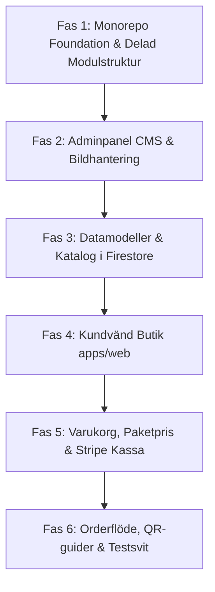

# Masterplan: Produktionsbygge av Öhlunds Brygga

> **Mål:** Bygga ett produktionsklart, skalbart och modulärt e-handelssystem med en integrerad **Adminpanel (CMS & Lagerstyrning)**, helt separerat från prototypen (`prototype-sandbox`).

---

## 1. Huvudarkitektur & Teknikstack

* **Monorepo-struktur:**
  - `apps/web`: Kundvänd e-handelsbutik (Next.js 16 App Router, Tailwind CSS, TypeScript).
  - `apps/admin`: Administratörspanel för teamet (produktkatalog, bildhantering, lager, ordrar, QR-kod/odlingsguide-redigering).
  - `packages/modules/*`: Delad affärslogik, modeller och databasgränssnitt (`catalog`, `orders`, `inventory`, `fulfillment`, `payments`).
  - `packages/ui`: Delat designsystem (tokens, knappar, inputs, badge-system).
* **Backend & Databas:**
  - **Firebase Firestore:** ACID-transaktioner för lagersaldo, reservationer och ordrar.
  - **Firebase Storage / CDN:** För uppladdade högupplösta produktbilder och foton från trädgården.
  - **Stripe Checkout & Webhooks:** Swish, Klarna, Kort med 30 minuters TTL-reservationer.
  - **Cloud Functions v2 (Node.js 24):** Idempotenta bakgrundstriggers (`{ retry: true }`).

---

## 2. Vad vi tar med oss från prototypen (Lärdomar)

1. **Fraktsmarta klasser:** `FLAT_LETTER` (29 kr / fri frakt över 350 kr) vs `BULKY_PARCEL` (79 kr / ombud).
2. **Paketpriser (Bundles):** Flexibel hybridmodell där 4 frösorter i korgen automatiskt ger paketpris (-23 kr), men faller tillbaka till styckpris om en sort tas bort.
3. **Kortdifferentiering (`ProductType`):** Olika kort för fröpåsar (`seed`), dahlia (`tuber`), tillbehör (`accessory`) och bukettpaket (`bouquet_bundle`).
4. **Persistent varukorg:** Synkronisering till `localStorage` utan att tappa korgen vid F5.
5. **Anti-Screen Theft:** Diskret toast vid köp istället för automatisk skärmstöld via drawern.
6. **Klippskydd & typografi:** `leading-tight` och `pt-1` på Å/Ä/Ö.
7. **Bannerfritt:** Ingen irriterande cookie-banner tack vare strikt funktionell lokal lagring.

---

## 3. Stegvis Implementationsplan (Fas 1 – Fas 6)

---

### Fas 1: Monorepo Foundation & Core Setup
- **Mål:** Etablera monorepo-infrastruktur och gemensam TypeScript/Tailwind-konfiguration utan att röra prototypen.
- **Åtgärder:**
  1. Skapa rot-`package.json`, `pnpm-workspace.yaml` (eller npm workspaces) och `tsconfig.base.json`.
  2. Etablera `packages/modules/catalog` och `packages/modules/orders`.
  3. Konfigurera delade designsystem-tokens i `packages/ui` (tallgrön, havre, terrakotta, sand, bark).
  4. Sätta upp ESLint med `eslint-plugin-boundaries` för att garantera modulernas strikta inkapsling.

---

### Fas 2: Adminpanel (`apps/admin`) – CMS & Bildhantering
- **Mål:** Ge Jessica, Ville, Magnus och Smilla verktyg att lägga till produkter, ladda upp egna foton och hantera sortimentet.
- **Åtgärder:**
  1. Skapa `apps/admin` (skyddad med Firebase Auth / e-postinloggning).
  2. **Produktredigerare (CRUD):**
     - Välj produkttyp (`seed`, `tuber`, `accessory`, `bouquet_bundle`).
     - Prissättning i ören (`amountInCents`).
     - Fraktklass (`FLAT_LETTER` eller `BULKY_PARCEL`).
     - Odlingszoner (1–8), såmånader, blomningstid och grobarhet.
  3. **Bildhantering (Media Manager):**
     - Bilduppladdning till Firebase Storage (framsidepåse, uppvuxen blomma, baksida med QR-kod).
     - Automatisk optimering till WebP med responsiva storlekar.
  4. **Bukettrecept & Paketredigerare:**
     - Koppla ihop vilka frösorter som ingår i bukettpaketet och sätt paketpris.

---

### Fas 3: Firestore Databas & ACID Transaktionslager
- **Mål:** Robust och säker databasinfrastruktur enligt guardrails i `AGENTS.md`.
- **Åtgärder:**
  1. Samlingar: `catalog_products`, `inventory_skus`, `orders`, `promotions`.
  2. Zod-validering i runtime för all data som korsar systemgränser.
  3. Transaktionsmodul (`packages/modules/inventory`):
     - Atomisk lagerkontroll och reservation.
     - All-or-nothing vid köp av paket.
     - TTL-hantering (30 minuter) för reservationer.

---

### Fas 4: Den Nya Kundvända Butiken (`apps/web`)
- **Mål:** Högpresterande, tillgänglig och vacker butik byggd på lärdomarna från prototypen.
- **Åtgärder:**
  1. Implementera startsida, katalog och kategorifiltrering baserad på live Firestore-data.
  2. Differentierade produktkort (`SeedCard`, `TuberCard`, `AccessoryCard`, `BundleCard`).
  3. Bildzoom med flikar för "🌸 Uppvuxen" och "📱 Baksida QR".
  4. Responsive layout (mobile-first, 44px touch-ytor, inga emojis i UI, Å/Ä/Ö-klippskydd).

---

### Fas 5: Varukorgsmotor, Paketkalkyl & Stripe Kassa
- **Mål:** Felfri kassa med fraktlogik, automatisk paketrabatt och säkra betalningar.
- **Åtgärder:**
  1. Varukorgshanterare synkad med `localStorage` (`ohlunds_cart`).
  2. Dynamisk paketrabattmotor: detekterar de 4 påsarna och applicerar paketpriset (-23 kr).
  3. Fraktväljare: hanterar brevfrakt 29 kr (fri över 350 kr) och spärrar fri frakt vid skrymmande paket (79 kr).
  4. Kampanjkodsmotor (`PERCENT`, `FIXED`, `FREE_SHIPPING`).
  5. Stripe Checkout Session Server Action med Swish, Klarna och Kort.

---

### Fas 6: Orderhantering, Digitala Odlingsguider & Kvalitetssäkring
- **Mål:** Automatiserat slutet flöde från lagd order till kundens trädgård.
- **Åtgärder:**
  1. Stripe Webhook $\rightarrow$ Firestore Orderbekräftelse $\rightarrow$ Lagersaldo minskas permanent.
  2. Digital odlingsguide via QR-kod (mobilvänlig landningssida per frösort, t.ex. `/guide/[slug]`).
  3. Plocklista och packvy i adminpanelen.
  4. Automatiserad verifiering:
     - `npm run typecheck`
     - `npm run lint`
     - `npm run test` (enhetstester för varukorgs- och rabattkalkylator)
     - `npm run test:e2e` (Playwright för Desktop & Mobil).
